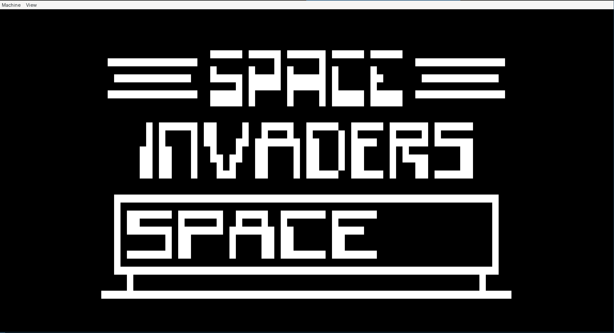

## chip8-efi

A CHIP-8 emulator built as a UEFI application.

This repository implements a CHIP-8 interpreter that runs natively in the UEFI environment. The output binary can be booted on UEFI systems or run inside a UEFI-capable virtual machine (e.g., QEMU). It loads CHIP-8 ROMs and executes them as if on a classic CHIP-8 virtual machine.

📌 What is CHIP-8?

CHIP-8 is a simple interpreted programming language originally developed in the 1970s for hobbyist computers (e.g., the COSMAC VIP).

🧠 Features
- UEFI-native CHIP-8 interpreter in C

- Boots directly via an EFI image

- Minimal dependencies — no OS required

- Includes a test script for quick validation

- Uses standard CHIP-8 input/output conventions

